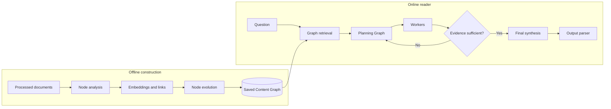
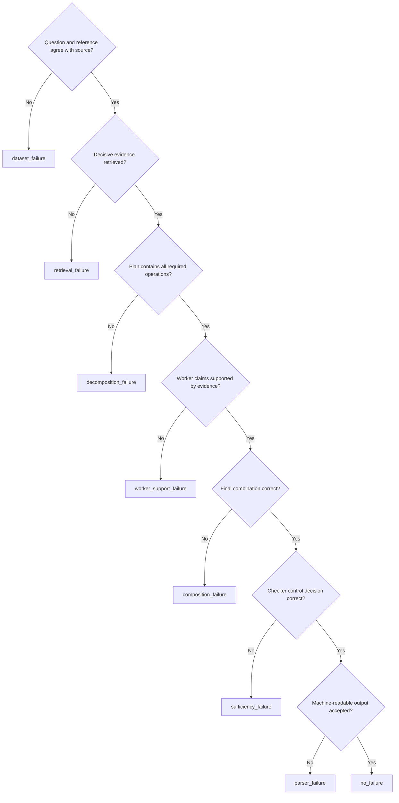
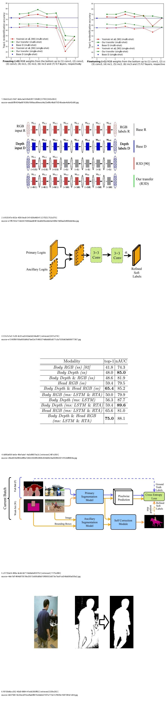
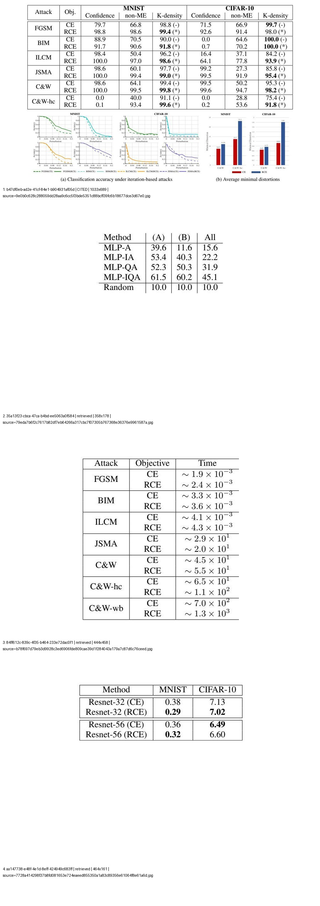
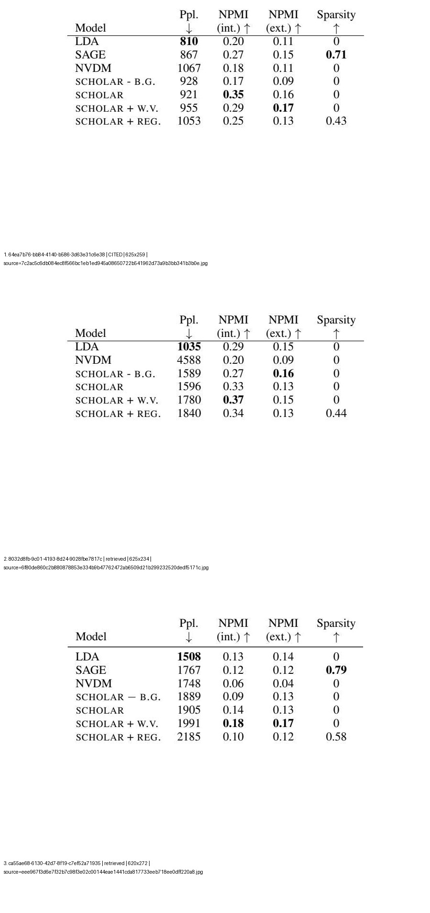
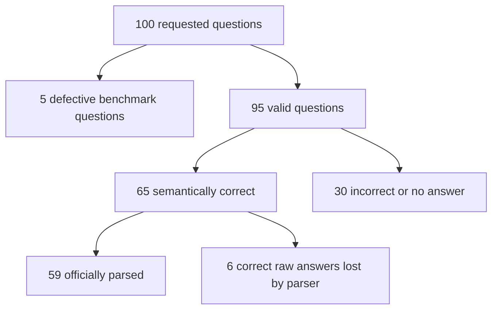
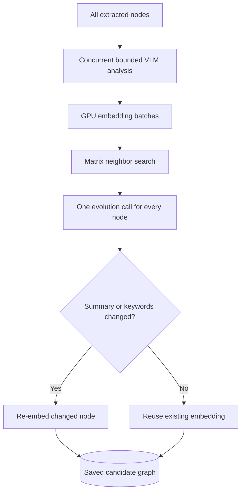

# Consolidated G²-Reader Experimental Findings

Last update: 2026-08-26

This document uses ASD-STE100 style where practical. Technical names, code
labels, model names, and benchmark identifiers are approved technical terms in
this document.

This document is the primary report for all G²-Reader experiments in this
workspace. It combines these studies:

- the official-runtime audit;
- the low-resource Content Graph experiment;
- the teacher/student loss evaluation;
- the SPIQA-100 failure audit;
- the matched 32B replays;
- the parser recovery;
- the raw-image review.

The detailed reports and the original traces remain the evidence sources. A
raw-source decision has priority over an earlier automatic decision.

## Contents

1. Main conclusions
2. Parts of the evaluated system
3. Experiment sequence
4. Failure terms
5. Final SPIQA-100 results
6. Content Graph construction results
7. Quality loss from the optimized graph
8. Structured-output results
9. Reader-model sensitivity
10. Repeatability
11. Scalability
12. Recommended repair sequence
13. Supported and unsupported claims
14. Evidence reports

## 1. Main conclusions

The experiments give five main conclusions.

### 1.1 Official-style graph construction is slow

The 32B teacher took a mean time of 2,979.94 seconds for five saved graphs.
This time is 49.67 minutes for each graph.

Each graph contained approximately 165 to 199 nodes. The system made one
initial VLM call for each node. It then made one evolution call for each node.
Thus, one graph required hundreds of VLM calls and approximately two million
tokens.

### 1.2 The optimized builder is much faster

The optimized 8B builder took a mean time of 141.14 seconds. This time is 2.35
minutes for each graph. The mean speed increase was 21.11 times.

The builder kept all extracted evidence nodes. It also evolved each node one
time. It did not use a question-dependent filter. It did not use selective
evolution.

### 1.3 The optimized builder causes a quality loss

We used the same 8B online reader with teacher graphs and candidate graphs. The
reader answered 5 of 5 questions correctly with the teacher graphs.

With the candidate graphs, the official system parsed 3 of 5 answers as
correct. Raw semantic review found 4 of 5 correct answers. One correct raw
answer failed because its final output tag was incomplete.

The candidate graphs contained the decisive evidence for all five questions.
Thus, normal top-5 retrieval recall was not the main problem. The main problem
was the description and use of the evidence.

### 1.4 Worker support is the largest answer-stage problem

The audit started with 100 SPIQA questions. We removed five defective benchmark
questions. The final valid set contained 95 questions.

The optimized-8B system gave 65 correct parsed or recoverable raw answers. It
gave 30 incorrect answers or no answers.

The final failure counts are:

- Worker support: 20;
- parser: 9;
- retrieval: 4;
- decomposition: 2;
- composition: 1.

### 1.5 Some defects are in the official G² interface

The official online planner makes tagged JSON from prompt instructions. The
planner does not use enforced JSON Schema output.

For `spiqa_96`, the matched 32B reader made invalid Planning Graph JSON on all
15 retries. A larger model did not remove this defect.

The final parser also rejects correct answers when the closing `</output>` tag
is absent. Thus, model quality is not the only cause of parser failures.

The main conclusion is:

> The optimized Content Graph builder is much faster. However, it is not yet a
> no-loss replacement for the 32B teacher. The online G² path is also not yet
> reliable for production use.

| Main measurement | Result |
|---|---:|
| Mean 32B teacher construction time | 2,979.94 s |
| Mean optimized-8B construction time | 141.14 s |
| Mean construction speed increase | 21.11 times |
| Candidate decisive evidence in top 5 | 5/5 |
| Same reader correct on teacher graphs | 5/5 |
| Same reader raw correct on candidate graphs | 4/5 |
| Mean teacher-graph query time | 47.27 s |
| Mean candidate-graph query time | 113.57 s |
| Valid SPIQA audit questions | 95 |
| Correct parsed or recoverable audit answers | 65/95 |

## 2. Parts of the evaluated system

G² has an offline phase and an online phase. Do not combine the measurements
from these two phases.

**Figure 1. G² system boundary**



The left side runs before question answering. The right side runs for each
question. A test can change one side and keep the other side constant.

### 2.1 Offline Content Graph construction

```text
processed documents
  → ordered text, table, and figure nodes
  → VLM analysis for each node
  → embeddings and initial links
  → graph evolution for each node
  → new embeddings for changed summaries
  → saved Content Graph
```

This phase does not use the question. A fixed document collection can use one
saved graph for many questions.

### 2.2 Online question answering

```text
question
  → retrieve evidence from the Content Graph
  → make a Planning Graph
  → run Workers in dependency order
  → check evidence sufficiency
  → refine the plan when necessary
  → make the final answer
  → parse the <output> tag
```

The online reader contains all operations in this second flow. It does not
build the Content Graph.

### 2.3 Evaluated configurations

We evaluated these configurations:

- **32B teacher construction:** The official traced builder used
  `Qwen3-VL-32B-Instruct-FP8`.
- **Optimized 8B construction:** The candidate builder used
  `Qwen3-VL-8B-Instruct-FP8` and safe scheduling changes.
- **Matched reader tests:** These tests held one component constant. They
  changed only the graph or only the online reader.

The SPIQA-100 results apply to the optimized-8B graph and the official G²
online path. They are not the results of the complete original 32B system.

| Test name | Graph builder | Online reader | Purpose |
|---|---|---|---|
| 32B teacher baseline | Qwen3-VL-32B | Qwen3-VL-32B | Measure the original-style full path. |
| Matched graph comparison | 32B or optimized 8B | Same Qwen3-VL-8B | Isolate Content Graph quality. |
| Matched reader replay | Same optimized-8B graph | 8B or 32B | Isolate online-reader sensitivity. |
| SPIQA-100 audit | Optimized Qwen3-VL-8B | Qwen3-VL-8B | Measure low-resource failures at larger scale. |

The matched tests are important. A full-pipeline comparison changes too many
components at the same time.

## 3. Experiment sequence

We did the work in this sequence:

1. We found and repaired the minimum official-runtime blockers.
2. We measured a fixed-seed 32B teacher graph.
3. We tested strict structured output with an 8B VLM.
4. We optimized one graph before we increased the test size.
5. We compared five teacher graphs with five candidate graphs.
6. We ran a resumable audit with 100 SPIQA questions.
7. We recovered explicit answers that the official parser rejected.
8. We reviewed suspected errors and found the earliest cause.
9. We replayed selected cases with the 32B reader.
10. We checked 12 disputed visual cases against the raw images.

| Phase | Main input | Main output | Decision gate |
|---|---|---|---|
| Runtime audit | Released official source | List of execution blockers | The official path must complete one valid case. |
| Teacher measurement | Saved 32B runs | Calls, tokens, and stage times | Keep a fixed teacher control. |
| Structured-output canary | Real analysis prompts | JSON and schema results | Require 100-percent valid completed responses. |
| One-graph optimization | `spiqa_58` | Fast candidate graph | Keep all nodes and decisive evidence. |
| Five-graph loss test | Five teacher/candidate pairs | Matched quality and time results | Reject a no-loss claim after one material loss. |
| SPIQA-100 execution | Fixed 100-question slice | Complete graphs and passive traces | Resume without loss after interruption. |
| Post-hoc review | Raw outputs and traces | Semantic and causal labels | Do not use exact match as final judgment. |
| Raw visual review | Exact graph images and source images | Final visual decisions | Correct provisional labels. |

This sequence prevents incorrect causal claims. A text mismatch is not always
an answer error. An 8B failure is not always an original G² failure. A bad
benchmark reference is not a system failure.

## 4. Failure terms

For each question, we identify the earliest decisive failure. A later failure
can also occur. We record that later failure as a secondary failure.

**Figure 2. Failure localization sequence**



Use the first failed test as the primary category. Record later effects as
secondary categories.

| Term | Main question | Example | Final count |
|---|---|---|---:|
| `dataset_failure` | Does the benchmark agree with the source? | `spiqa_452` | 5 excluded |
| `retrieval_failure` | Did the Worker receive the decisive evidence? | `spiqa_578` | 4 |
| `worker_support_failure` | Does the evidence support the Worker answer? | `spiqa_4` | 20 |
| `decomposition_failure` | Did the plan request every necessary operation? | `spiqa_44` | 2 |
| `composition_failure` | Did final synthesis combine correct inputs correctly? | `spiqa_47` | 1 |
| `sufficiency_failure` | Did the checker make the correct control decision? | `spiqa_542` | Secondary only |
| `parser_failure` | Did software accept valid answer structure? | `spiqa_39`, `spiqa_96` | 9 phenomena |
| `infrastructure_failure` | Did plumbing stop valid execution? | Undefined embedding client | Excluded |
| `unverifiable` | Is the stored evidence sufficient for review? | Raw visual queue | 0 unresolved |
| `no_failure` | Is the answer correct and supported? | `spiqa_163` | Not a failure |

### 4.1 `dataset_failure`

#### Meaning

The benchmark question or reference is defective. The source can contradict
the reference. The question and the reference can also ask for different
information.

Do not use this question to measure system accuracy.

#### Test

1. Read the literal question.
2. Read the reference answer.
3. Inspect the source paper, table, or figure.
4. Make sure that one source-supported answer can satisfy both items.

#### Example: `spiqa_452`

The figure uses bubble size for tOF. ENet is the largest bubble. However, a low
tOF value gives better temporal coherence.

The question incorrectly says that the largest tOF is the best result. The
reference gives TecoGAN because TecoGAN has better low tOF. The question mixes
two incompatible conditions.

#### Other examples

- `spiqa_79` contains only `New question:` as its question.
- `spiqa_164` asks about Node 1, but the reference gives the hop count for the
  complete topology.
- `spiqa_195` says that both ACGAN losses decrease. The raw curves do not show
  this behavior.
- `spiqa_281` specifies a fully inverse relation. The source shows a
  hump-shaped Luhn profile.

Final count: **5 excluded questions**.

### 4.2 `retrieval_failure`

#### Meaning

The Worker does not receive the evidence that is necessary for the answer. A
related table is not sufficient when the required row or column is absent.

#### Test

1. Identify the minimum evidence for the answer.
2. Inspect the retrieved node IDs and their contents.
3. Make sure that the decisive row, figure, or passage is present.

If the evidence is absent, a better Worker cannot reliably answer the
question.

#### Example: `spiqa_578`

The question asks for the topic words with the highest internal coherence.
Retrieval returned Table 4. Table 4 contains model-level NPMI values. It does
not contain the required topic rows.

The system answered `SCHOLAR`. The required Table 6 was absent. Table 6 gives
this topic at 0.77:

```text
turks armenian armenia turkish roads escape soviet muslim mountain soul
```

The raw-image review changed the early Worker label to retrieval failure.

Final count: **4**. The question IDs are `spiqa_292`, `spiqa_396`,
`spiqa_510`, and `spiqa_578`.

### 4.3 `worker_support_failure`

#### Meaning

The Worker receives the decisive evidence but does not use it correctly. The
Worker can select a wrong row, panel, label, value, or unit. It can also make a
claim that the evidence does not support.

#### Test

1. Make sure that the exact evidence is in the Worker context.
2. Compare each value, label, and unit with the source.
3. Check each calculation and claim.
4. Make sure that the Planning Graph asked for the correct operation.

If the plan is correct and the intermediate answer is wrong, classify the case
as a Worker support failure.

#### Example: `spiqa_4`

The retrieved table gives 16,198 total negative CNSE samples. The question asks
for the number in a 60-percent training split.

The Worker copied 16,198. It did not calculate 60 percent of 16,198. The
supported answer is approximately 9,719.

#### Example: `spiqa_116`

The correct figure was present. At x=7, both curves are near 71 to 72 percent.
The proposed method is only slightly better.

The 8B answer reported an advantage of approximately ten percentage points.
The raw figure does not support this value.

#### Example: `spiqa_368`

The correct MNIST attack curves were present and readable. The Workers said
that the evidence was not available. Final generation then ended without a
usable answer tag.

The early label was retrieval failure. Raw visual review showed that retrieval
was successful. Thus, Worker support is the primary failure. Parser failure is
a secondary failure.

Final count: **20**. This is the largest failure group. Eighteen rationales in
this group contain table, figure, value, or trend terms.

### 4.4 `decomposition_failure`

#### Meaning

The Planning Graph does not include a necessary task. It can also describe a
task incorrectly. Workers cannot reliably do an operation that the plan does
not request.

#### Test

1. List the minimum operations for the question.
2. Compare the list with the Planning Graph tasks.
3. Check for a missing comparison, complement, calculation, or condition.

#### Example: `spiqa_44`

The question asks for differences between sickle-cell and leukemia patterns.
The plan makes one task for each patient. It does not make a comparison task.

The final answer discusses leukemia only. It does not answer the comparison
question.

#### Example: `spiqa_571`

The plan searches for one step with a direct change from 5,119 to 1,955. The
table shows a sequence of reductions. Step 4 produces the final value of 1,955.

The incorrect task description prevents the system from accepting Step 4. The
system gives no final answer.

Final count: **2**. The question IDs are `spiqa_44` and `spiqa_571`.

### 4.5 `composition_failure`

#### Meaning

Retrieval is correct. The Workers also give correct intermediate results. A
parent task or final synthesis combines these results incorrectly.

#### Test

1. Verify each intermediate result.
2. Do the final operation independently.
3. Compare this result with the final answer.

#### Example: `spiqa_47`

The Workers correctly find these disagreement rates:

- before: 44.85 percent;
- after GBI: 24.92 percent;
- after A*: 33.91 percent.

The individual reductions are 19.93 and 10.94 percentage points. Final
synthesis reports their 8.99-point absolute difference. The reference requires
a different comparison of the reductions.

The intermediate values are correct. The final combination is wrong.

Final count: **1**.

### 4.6 `sufficiency_failure`

#### Meaning

The sufficiency checker makes an incorrect control decision. It can stop when
an evidence gap remains. It can also request unnecessary work when the answer
is already available.

A sufficiency failure can cause a wrong answer. It can also cause only a time
penalty. No sufficiency failure remained as a primary category in the final 30
incorrect or empty outcomes. However, it was an important secondary problem.

#### Example: `spiqa_542`

The first Worker had the decisive `RCE = 0.77` row. The sufficiency response
was incomplete and could not be parsed.

Official G² treated the parse failure as insufficient evidence. The system ran
four Planning Graphs, 13 Worker tasks, four checks, and 22 model calls. It then
returned the answer that was available in the first round.

#### Example: `spiqa_108`

The system had Figure 3 and the supporting ESMM text. The checker requested
exact chart values that the benchmark question did not require.

The system used all four refinement rounds. Query time increased to 253.51
seconds. Final synthesis was correct, but the output parser rejected it.

### 4.7 `parser_failure`

#### Meaning

The model makes useful answer content, but the software cannot read the
required structure.

There are two parser locations.

#### Planning Graph parser failure

The planner writes JSON inside `<dag>` tags. The official model call does not
enforce a JSON schema. Invalid JSON stops Worker execution.

Example: `spiqa_96`

The Content Graph was valid. Each Planning Graph response contained invalid
JSON escapes. The matched 32B reader repeated this error on all 15 retries.

This is an official structured-output interface defect. It is not only an 8B
model defect.

#### Final-output parser failure

The official parser requires this format:

```text
<output>answer</output>
```

If `</output>` is absent, the parser returns `None`.

Example: `spiqa_39`

The raw answer correctly describes the faster TRPO gradient convergence. The
opening `<output>` tag is present. The closing tag is absent. A human can read
the answer, but the official parser records no prediction.

The audit had 98 completed query outputs. The official parser accepted 80
outputs. Ten outputs had an explicit recoverable opening tag without a closing
tag. Eight outputs had no safe answer candidate.

Semantic review found six valid questions with correct raw answers that the
final parser rejected.

| Parser result | Question IDs | Meaning |
|---|---|---|
| Correct raw answer lost | `spiqa_29`, `spiqa_39`, `spiqa_55`, `spiqa_61`, `spiqa_249`, `spiqa_272` | The answer was present, but the final tag structure failed. |
| Final response incomplete or no safe answer | `spiqa_26`, `spiqa_223` | The reasoning had useful evidence, but no safe complete final answer was available. |
| Planning Graph JSON invalid | `spiqa_96` | Worker execution could not start. |

Final parser-phenomenon count: **9**. This count includes wrong or empty
outcomes and correct raw answers that the parser lost.

### 4.8 `infrastructure_failure`

#### Meaning

The run fails because of software plumbing or service operation. The failure
does not measure answer reasoning.

#### Examples

- The official runtime did not define `embed_aclient`.
- The official code supplied `max_tokens` to a function that did not accept
  this argument.
- The save path used `<id>_iter_<round>`, but the cache check used only `<id>`.
- Final logging required an optional `judge` field and caused a `KeyError`.
- One VLM server stopped after 14 valid requests. The log showed SIGTERM but no
  CUDA or GPU-memory error.

The evolution signature defect was dangerous. The node exception handler kept
the original nodes after each failure. Thus, the run could report an evolution
round when no VLM evolution occurred.

We exclude infrastructure-blocked runs from answer accuracy.

| Blocker | Observed effect | Minimum repair | Behavior effect |
|---|---|---|---|
| Undefined `embed_aclient` | All embedding calls failed. Retrieval continued with empty evidence. | Bind the configured embedding client. Fail the question on construction error. | Plumbing only |
| Evolution signature mismatch | Each evolution call rejected `max_tokens`. Original nodes remained unchanged. | Accept and forward the existing argument. | Restores intended evolution |
| Cache-path mismatch | The runtime did not load saved evolved graphs. | Check the full `<id>_iter_<round>` path. | Persistence only |
| Missing optional `judge` | Logging crashed after final synthesis. | Use `item.get('judge')`. | Logging only |
| Truncated image JSON | One image became a failure note. | Retry once with a strict bounded schema. | Error recovery only |
| Prompt/consumer field mismatch | Strict output omitted required `text_content`. | Make the schema agree with the consumer. | Interface repair |

### 4.9 `unverifiable`

#### Meaning

The saved evidence is not sufficient for a reliable decision. The image can be
too small, clipped, unreadable, or without clear source information.

This label is temporary. It is not proof of a system failure.

We decoded the exact graph images for 12 disputed visual cases. We matched each
image to the source with image dimensions and perceptual hashes. After this
work, zero cases remained unverifiable.

| Question | Final decision | Main raw-image finding |
|---|---|---|
| `spiqa_116` | Worker support | The curves differ only slightly at x=7. The reported ten-point difference is false. |
| `spiqa_163` | No failure | The image supports recursive four-part Hilbert construction. |
| `spiqa_164` | Dataset failure | Node 1 is the directly connected border router. The reference uses the full topology. |
| `spiqa_195` | Dataset failure | The orange ACGAN loss rises with high variation. Both losses do not decrease. |
| `spiqa_215` | No failure | RGB features are texture-rich. Depth features show cleaner shapes. |
| `spiqa_234` | No failure | PPL decreases with K and approaches the RNTN baseline. |
| `spiqa_235` | No failure | Error decreases with FLOPS. The small adaptive ANN performs better. |
| `spiqa_281` | Dataset failure | The plot has a middle peak. It is not fully inverse with frequency. |
| `spiqa_368` | Worker support plus parser | The correct attack curves were present. The Workers did not read them. |
| `spiqa_452` | Dataset failure | ENet is the largest bubble. TecoGAN has the better low tOF value. |
| `spiqa_578` | Retrieval | Table 4 was present. The required topic rows from Table 6 were absent. |
| `spiqa_98` | Worker support plus parser | Goodput decreases. Segment loss is small and not monotonic. |

**Figure 3. `spiqa_116` evidence packet**



The labels show the retrieved and cited graph images. The chart permits a
direct check of the x=7 claim.

**Figure 4. `spiqa_368` evidence packet**



The required attack plot was in the retrieved evidence. This image changed the
primary label from retrieval failure to Worker support failure.

**Figure 5. `spiqa_578` evidence packet**



The retrieved images contain model-level results. They do not contain the
required topic-word table.

### 4.10 `no_failure`

#### Meaning

The answer is correct and sufficiently supported. It does not have to use the
same words as the reference.

#### Example: `spiqa_163`

The answer describes recursive four-part subdivision of the Hilbert pattern.
This description has the same meaning as the reference. Raw visual review
changed the provisional failure label to `no_failure`.

This category shows a problem with exact string comparison. The live dashboard
found only five normalized exact matches. The final semantic review found 65
correct answers in the 95 valid questions.

## 5. Final SPIQA-100 results

### 5.1 Valid questions

- Requested questions: **100**
- Defective benchmark questions: **5**
- Valid questions: **95**

The excluded IDs are `spiqa_79`, `spiqa_164`, `spiqa_195`, `spiqa_281`, and
`spiqa_452`.

### 5.2 Answer results

- Officially parsed and semantically correct: **59/95**
- Additional correct raw answers rejected by the parser: **6**
- Total correct parsed or recoverable answers: **65/95**
- Incorrect answers or no answers: **30/95**
- Ambiguous valid results: **0**

**Figure 6. Final outcome accounting**



Do not add the five defective questions to the system error count. Also, do not
add the six parser losses to the 30 incorrect outcomes. The six answers are
semantically correct.

### 5.3 Failure counts

| Failure | Count | Meaning |
|---|---:|---|
| Worker support | 20 | The Worker used retrieved evidence incorrectly. |
| Parser | 9 | The software could not read Planning Graph or final output structure. |
| Retrieval | 4 | The task did not receive decisive evidence. |
| Decomposition | 2 | The plan omitted or changed a necessary operation. |
| Composition | 1 | Final synthesis combined correct inputs incorrectly. |
| **Total phenomena** | **36** | 30 wrong or empty outcomes plus six correct raw answers lost by parsing. |

The total is not 36 wrong questions. One question can have a primary failure
and a secondary failure.

| Failure | Final question IDs |
|---|---|
| Worker support | `spiqa_0`, `spiqa_110`, `spiqa_116`, `spiqa_18`, `spiqa_181`, `spiqa_196`, `spiqa_222`, `spiqa_245`, `spiqa_34`, `spiqa_347`, `spiqa_368`, `spiqa_381`, `spiqa_392`, `spiqa_4`, `spiqa_434`, `spiqa_440`, `spiqa_522`, `spiqa_585`, `spiqa_586`, `spiqa_98` |
| Parser | `spiqa_223`, `spiqa_249`, `spiqa_26`, `spiqa_272`, `spiqa_29`, `spiqa_39`, `spiqa_55`, `spiqa_61`, `spiqa_96` |
| Retrieval | `spiqa_292`, `spiqa_396`, `spiqa_510`, `spiqa_578` |
| Decomposition | `spiqa_44`, `spiqa_571` |
| Composition | `spiqa_47` |

## 6. Content Graph construction results

### 6.1 Cause of the long construction time

For `spiqa_58`, the 32B teacher processed five documents and 182 nodes. It used:

- 130 text-analysis calls;
- 53 image-analysis calls, including one retry;
- 182 evolution calls;
- 365 total VLM calls;
- 2,263,224 VLM tokens;
- 45,916 embedding tokens.

VLM work caused most of the delay. Evolution and image analysis were the
largest stages. Graph operations and disk operations were not the main causes.

More disk capacity can store more caches. It cannot make hundreds of GPU model
calls much faster.

The unoptimized 8B build took 1,510.77 seconds. This time is 25.18 minutes. Its
main avoidable delays were:

- image responses that continued to the 8,192-token limit;
- hundreds of one-item embedding requests;
- repeated raw neighbor text in evolution prompts.

| `spiqa_58` stage | 32B teacher | Unoptimized 8B | Optimized 8B v5 |
|---|---:|---:|---:|
| Text analysis | 474.72 s | 358.97 s | 60.51 s |
| Image analysis | 652.37 s | 653.97 s | 91.64 s |
| Initial embeddings | 141.07 s reported total embedding stage | 100.76 s | 3.64 s |
| Evolution | 1,959.69 s | 336.05 s | 65.41 s |
| Changed-node re-embedding | Included above | 60.59 s | 0.92 s |
| Complete measured build | 3,227.84 s | 1,510.77 s | 158.76 s |

The optimized text and image queues overlap. Do not add their stage times to
calculate the total time. The table shows where the work decreased.

### 6.2 Optimization methods

The successful builder used these methods:

- strict and bounded JSON schemas on the first request;
- concurrent text and image analysis with one global request limit;
- batched BGE-M3 embeddings on the GPU;
- matrix neighbor selection from saved embeddings;
- new embeddings only for changed summaries or keywords;
- initial and evolved analysis in the retrieval representation;
- saved neighbor summaries instead of repeated full raw neighbor text;
- bounded recovery that keeps the raw node when metadata analysis fails.

The builder did not remove question-independent G² operations. It analyzed all
nodes and evolved all nodes.

**Figure 7. Safe construction optimization path**



The path keeps the G² analysis and evolution operations. It removes repeated
transport, repeated embedding, and unnecessary prompt text.

### 6.3 Construction performance

| Measurement | 32B teacher | Optimized 8B candidate |
|---|---:|---:|
| Mean construction time | 2,979.94 s | 141.14 s |
| Mean construction time | 49.67 min | 2.35 min |
| Mean speed increase | — | 21.11 times |
| Maximum candidate time | — | 169.10 s |

| Question | Evidence type | Teacher nodes | Candidate nodes | Teacher build | Candidate build | Speed increase |
|---|---|---:|---:|---:|---:|---:|
| `spiqa_58` | Figure and text | 182 | 182 | 3,227.84 s | 156.47 s | 20.63 times |
| `spiqa_108` | Multi-line chart | 169 | 169 | 2,392.51 s | 134.75 s | 17.76 times |
| `spiqa_378` | Numerical table | 164 | 165 | approximately 2,347 s | 106.81 s | 21.97 times |
| `spiqa_540` | Figure and formula | 199 | 203 | 4,226.00 s | 169.10 s | 24.99 times |
| `spiqa_542` | Table and figure | 179 | 179 | 2,706.37 s | 138.55 s | 19.53 times |

The teacher removed some chunks after it made the upstream
`No meaningful information` value. The candidate kept the raw nodes. This
condition explains the small node-count differences.

The 100-question run gave these results:

- 100 of 100 Content Graphs completed;
- mean new graph time was 160.85 seconds;
- 98 online queries completed;
- two queries failed after all Planning Graph retries;
- mean completed query time was 71.82 seconds.

### 6.4 Rejected optimization trials

We did not accept a trial only because it was fast.

- Trial v1 lost analyses because some structured outputs were invalid or
  incomplete.
- Trial v2 took 145.71 seconds but removed most useful text nodes. A bad schema
  made their summaries equal to `No meaningful information`.
- Trial v4 took 146.77 seconds but removed 25 valid chunks. An aggressive
  bibliography instruction caused this loss.

Each accepted latency result must also pass node, retrieval, and answer checks.

## 7. Quality loss from the optimized graph

The paired test used the same 8B online reader for both graph types.

| Measurement | Teacher graph | Candidate graph |
|---|---:|---:|
| Parsed correct answers | 5/5 | 3/5 |
| Raw semantically correct answers | 5/5 | 4/5 |
| Mean cached-query time | 47.27 s | 113.57 s |
| Decisive evidence in candidate top 5 | — | 5/5 |

Candidate graph query time was 2.40 times longer. The candidate metadata caused
more sufficiency refinement.

| Question | Reader on teacher graph | Time | Reader on candidate graph | Time | Main result |
|---|---|---:|---|---:|---|
| `spiqa_58` | Correct | 36.79 s | Correct | 40.94 s | No material answer loss |
| `spiqa_108` | Correct and parsed | 110.13 s | Correct raw answer; parsed `null` | 253.51 s | Checker and parser instability |
| `spiqa_378` | Exact answer | 40.30 s | Exact answer after repair | 155.52 s | Worker table error repaired by refinement |
| `spiqa_540` | `DMRNet` | 28.04 s | Evidence reported unavailable | 31.87 s | Confirmed answer loss |
| `spiqa_542` | `RCE` | 21.08 s | `RCE` | 86.02 s | Correct with unnecessary refinement |

This table uses one online model on both graph types. Thus, the graph is the
only planned difference in each row.

### 7.1 Clear quality loss: `spiqa_540`

The candidate retrieved the correct Figure 3 at rank one. Its OCR contained
the correct `L = 9` values. The values showed that DMRNet was best.

The Worker read the panels as `L=12` and `L=96`. It then said that the `L=9`
result was not available. The same reader answered `DMRNet` with the teacher
graph.

A raw image at rank one does not guarantee equal performance. The graph
summary and context can change how the Worker reads the image.

### 7.2 Repaired Worker error: `spiqa_378`

The candidate retrieved the decisive table at rank one. One Worker read the
correct DLA values. A different Worker used the wrong NoCorrect row and
calculated zero improvement.

Global refinement finally made the correct answer. Query time increased from
40.30 seconds to 155.52 seconds.

### 7.3 Correct but slow: `spiqa_542`

Both graphs produced `RCE`. Candidate graph query time increased from 21.08
seconds to 86.02 seconds because of an unnecessary adjustment round.

### 7.4 Quality conclusion

The scheduling optimizations do not remove raw evidence. The main risk comes
from the smaller construction model and its shorter visual and evolution
metadata.

The current data rejects this statement:

```text
The optimized builder is 21 times faster with no performance loss.
```

## 8. Structured-output results

### 8.1 Enforced schemas make 8B JSON reliable

The conservative 8B server completed 40 of 40 constrained requests. All
responses were valid JSON and passed their schemas.

The earlier Qwen2.5-VL-7B server accepted
`response_format={"type":"json_object"}` but did not enforce it. Thus, the
model could still make invalid JSON.

A reliable interface needs these two items:

1. The server must enforce a grammar or JSON schema.
2. The schema must agree with the fields that the code reads.

The official image prompt requested three fields. The consumer required a
fourth field named `text_content`. Strict output exposed this producer/consumer
mismatch.

### 8.2 A larger model does not guarantee valid structure

The 32B reader also made invalid Planning Graph JSON for `spiqa_96`. Model size
can reduce some semantic errors. It does not guarantee valid software
interfaces.

### 8.3 Recovery must be narrow

The audit recovered an answer only when an explicit `<output>` opening tag was
present. The audit did not use hidden thought text as an answer.

This rule keeps the original audit evidence unchanged. It also shows exactly
which answers the official parser lost.

## 9. Reader-model sensitivity

We replayed 11 selected questions with the 32B online reader. We kept the same
optimized-8B Content Graph.

The results were:

- completed replays: 11/11;
- official parser successes: 11/11;
- semantically correct 32B answers: 5/11 before later raw-source corrections;
- 8B incorrect and 32B correct: 4;
- 8B correct and 32B incorrect: 0.

| Question | 8B audit category at replay time | 32B parser | 32B semantic result | Replay time |
|---|---|---|---|---:|
| `spiqa_39` | Parser | Success | Correct | 277.18 s |
| `spiqa_4` | Worker support | Success | Correct | 85.05 s |
| `spiqa_110` | Worker support | Success | Incorrect | 113.61 s |
| `spiqa_116` | Worker support | Success | Correct | 96.07 s |
| `spiqa_522` | Worker support | Success | Incorrect | 92.43 s |
| `spiqa_163` | Provisional retrieval | Success | Correct | 110.33 s |
| `spiqa_195` | Provisional retrieval | Success | Incorrect | 90.66 s |
| `spiqa_396` | Retrieval | Success | Correct | 120.07 s |
| `spiqa_44` | Decomposition | Success | Incorrect | 168.82 s |
| `spiqa_571` | Decomposition | Success | Incorrect | 452.45 s |
| `spiqa_47` | Composition | Success | Incorrect | 177.27 s |

The table shows the categories at replay time. Later raw-image review changed
`spiqa_163` to no failure and changed `spiqa_195` to dataset failure.

These results show that some failures depend on the online model. A stronger
reader repaired some cases, but it did not repair all cases.

The 32B reader did not repair `spiqa_44`, `spiqa_571`, or `spiqa_47`. This
supports Planning Graph and composition concerns.

The 32B reader also repeated the `spiqa_96` parser defect. This supports an
official interface concern.

These tests are not a complete original-32B baseline. The Content Graph was
still the optimized-8B graph.

Use these claim levels:

- **Observed in the low-resource system:** This applies to all final audit
  counts.
- **Sensitive to the reader model:** This applies when a matched 32B replay
  changes the result.
- **Part of the official G² design or interface:** This requires reproduction
  on the official path.

## 10. Repeatability

A fixed seed did not make the full system fully repeatable. `spiqa_540` failed
in one matched run. It answered correctly in a later run with the nominally
same graph, model, and seed.

Possible causes include:

- concurrent request order;
- nondeterministic GPU operations;
- small text differences that change the refinement path;
- different server state.

Do not remove a recorded failure because one later run succeeds. A production
evaluation must measure repeated-run stability and one-run accuracy.

## 11. Scalability

The Content Graph does not depend on a question. However, the current workflow
saves graphs for question-specific document bundles. It does not use one
deduplicated artifact for each stable document or collection version.

At 160.85 seconds for each sequential cold build, 17,000 builds would take
approximately 31.6 days. This value is an extrapolation. We did not run a
17,000-document benchmark.

| Sequential cold builds | Optimized mean at 160.85 s | Teacher mean at 2,979.94 s |
|---:|---:|---:|
| 100 | 4.47 hours | 3.45 days |
| 1,000 | 1.86 days | 34.49 days |
| 17,000 | 31.65 days | 586.33 days |

This table assumes one sequential build for each item. It does not include
parallel servers, shared documents, or content-hash reuse. Each measured graph
also contains a document bundle. Thus, the table is a workload warning and not
a measured deployment result.

A large deployment needs these functions:

- analysis and embedding caches that use document content hashes;
- incremental graph updates for changed documents;
- deduplication across document bundles;
- graph loading that does not use the question ID;
- distributed or batched offline ingestion;
- online retrieval from saved graph artifacts.

More disk capacity helps store these artifacts. It does not replace the GPU
work for cold construction.

## 12. Recommended repair sequence

### 12.1 First repair: evidence-grounded Workers

Worker support is the largest failure group. Most cases use tables, figures,
values, or trends.

Require each Worker to return these fields:

- answer;
- cited evidence-node IDs;
- extracted values and labels;
- units;
- arithmetic or comparison operation.

Then do these operations:

1. Make sure that each cited node was retrieved.
2. Compare each value, label, and unit with the cited evidence.
3. Do numerical calculations with deterministic code.
4. If verification fails, give the Worker focused rows, columns, or a zoomed
   image.
5. Run that Worker one more time.
6. Run only the parent Planning Graph tasks that use the corrected result.
7. Use global replanning only when local repair fails.

Test this repair against the unchanged baseline. Do not claim an improvement
before the test is complete.

### 12.2 Repair the structured interfaces

Do these changes separately from reasoning changes:

- enforce schemas for Planning Graph and checker outputs;
- make prompt schemas agree with consumer fields;
- use output limits that agree with the data contract;
- do not treat an unparseable check as insufficient evidence;
- accept a complete explicit output body when only its closing tag is absent;
- do not use hidden thought text as the final answer.

### 12.3 Repair visual metadata

Compare teacher and student metadata for the decisive visual nodes. Start with
`spiqa_540`.

Use the same Worker prompt with these inputs:

- raw image and 32B teacher summary;
- raw image and 8B student summary;
- raw image only.

This test will show which summary information is necessary. After this test,
evaluate a selective teacher fallback or a distilled visual model.

### 12.4 Repair query-time efficiency

Use local repair instead of global refinement when possible. Cache all
question-independent document work by content hash.

Measure cold construction time and cached-query time. The fast candidate graph
currently causes longer online time in some cases.

## 13. Supported and unsupported claims

### 13.1 Supported claims

- The optimized builder is much faster on the tested L40S system.
- All five final candidate builds completed in less than three minutes.
- Candidate top-5 retrieval contained decisive evidence for all five paired
  questions.
- Candidate graph operational quality was lower than teacher graph quality.
- Worker support was the largest failure group in the low-resource audit.
- The official structured-output and parser interfaces have repeatable defects.
- Five benchmark questions are not suitable for accuracy measurement.

### 13.2 Unsupported claims

- The optimized builder has no quality loss.
- The 65/95 result is the accuracy of the complete original 32B G² system.
- All low-resource Worker failures are part of original G².
- Five questions give a dataset-level loss rate.
- The four visual benchmark defects are ready for publication without a second
  independent human review.
- The system has been tested on 17,000 documents.

## 14. Evidence reports

Use these reports for detailed evidence:

- [`low_resource_content_graph/REPORT.md`](low_resource_content_graph/REPORT.md)
  contains the construction optimization sequence.
- [`low_resource_content_graph/loss_evaluation/REPORT.md`](low_resource_content_graph/loss_evaluation/REPORT.md)
  contains the five-question graph comparison.
- [`failure_audit_100/REPORT.md`](failure_audit_100/REPORT.md) contains the
  resumable audit record.
- [`failure_audit_100/posthoc_adjudication/POSTHOC_REPORT.md`](failure_audit_100/posthoc_adjudication/POSTHOC_REPORT.md)
  contains the final audit totals.
- [`failure_audit_100/posthoc_adjudication/PARSER_RECOVERY.md`](failure_audit_100/posthoc_adjudication/PARSER_RECOVERY.md)
  contains the recovered explicit outputs.
- [`failure_audit_100/posthoc_adjudication/REPLAY_ADJUDICATION.md`](failure_audit_100/posthoc_adjudication/REPLAY_ADJUDICATION.md)
  contains the matched 32B reader results.
- [`failure_audit_100/posthoc_adjudication/DATA_INTEGRITY.md`](failure_audit_100/posthoc_adjudication/DATA_INTEGRITY.md)
  contains the invalid benchmark rows and the `spiqa_96` reproduction.
- [`failure_audit_100/posthoc_adjudication/visual_validation/VISUAL_VALIDATION.md`](failure_audit_100/posthoc_adjudication/visual_validation/VISUAL_VALIDATION.md)
  contains the final decisions for the 12 visual cases.

For a disputed label, use this priority:

```text
raw source or image review
  > trace-based causal review
  > semantic answer review
  > exact string comparison
```
